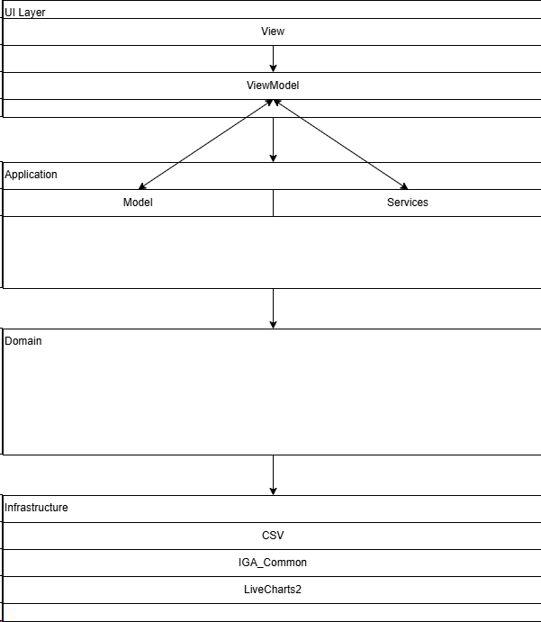

# Instant Graph Application Software Design Document

## 0. 문서 메타 정보

### 0.1 문서 버전

V1.3 초안 단계(Draft)

### 0.2 문서 변경 내역

| 날짜       | 문서 버전    | 작성자                  | 변경 내역                                                    |
| ---------- | ------------ | ----------------------- | ------------------------------------------------------------ |
| 2025-09-03 | V1.0 (Draft) | 윤상현(UpsilonSigmaEta) | 문서 최초 작성 시작0. 문서 메타 정보 기입1. 목적 \& 범위 작성2. 주요 유스 케이스 작성 |
| 2025-09-05 | V1.1         | 윤상현(UpsilonSigmaEta) | 3, 4, 5 단락 추가                                            |
| 2025-10-31 | V1.2         | 윤상현(UpsilonSigmaEta) | .html에서 Markdown으로 문서 포맷 변경                        |
| 2025-10-31 | V1.3         | 윤상현(UpsilonSigmaEta) | 5.3 단락 작성                                                |

## 1. 목적 \& 범위

### 1.1 목적

','로 구분되어 있는 CSV 파일을 불러와서 빠르게 그래프를 그리고, 그려진 그래프를 분석할 수 있는 추가적인 기능을 제공하는 SW를 제작한다. 또한, 불러온 데이터에 대한 일부 편집 기능을 제공하는 SW를 작성한다.

### 1.2 범위

SW는 다음과 같은 기능을**포함한다.**

- CSV 파일을 불러와서 파싱하고, 이를 UI에 표의 형태로 표시하는 기능.
- 불러온 데이터를 바탕으로 그래프를 그리는 기능
- 그려진 그래프에서 최댓값, 최솟값등을 찾는 등의 기본적인 분석 기능

SW는 다음과 같은 기능을**포함하지 않는다.**

- 선형 회귀 분석등의 고급 분석 기능
- CSV 파일을 제외한 다른 파일들(예. .xlsx 파일 등)을 불러와서 화면에 표시하는 기능
- 고급 데이터 편집 및 계산, 연산 기능

## 2. 주요 유스케이스

### 2.1 CSV 파일 불러오기

| Use Case ID        | UC-01                                                        |
| ------------------ | ------------------------------------------------------------ |
| 이름               | CSV를 불러와서 표 형태로 나타난 화면 보기                    |
| 레벨               | 사용자 목표                                                  |
| 주요 행위자        | 분석가 (단일 사용자)                                         |
| 범위               | IGA                                                          |
| 이해관계/이득      | 분석가 : 빠르게 데이터를 표의 형태로 시각화하여 주요 데이터를 확인 |
| 사전조건           | 로컬에 CSV 파일 존재, 사용자에게 읽기 권한 있음, IGA 작동중  |
| 최소 보장          | 파일의 손상 또는 잘못된 파일 포맷으로 인한 오류일 경우, 유스케이스를 종료하고 사용자에게 이를 고지 |
| 성공 보장          | CSV 파일을 불러와서 올바르게 헤더와 함께 표의 형태로 내용을 표시 |
| 트리거             | 사용자가 도구 모음에서 '파일 열기'를 클릭함                  |
| 메인 성공 시나리오 | 1. 사용자가 CSV 파일을 선택한다.2. 응용 프로그램은 해당 CSV 파일의 내용을 읽어온다. CSV 파일의 내용을 읽어오는 것이 끝나면 해당 파일을 닫는다.3. 읽어온 CSV 파일의 내용을 파싱해서 첫 번째 행을 Header로 삼는다.4. 두 번째 행부터 Content로 삼고, CSV 파일의 이름으로 생성된 탭의 데이터 그리드에 데이터를 채워넣는다.5. 분석 도구모음의 항목들을 활성화 시킨다. |
| 대안/예외 흐름     | 1a. 기본 인코딩이 UTF-8이 아님 → 사용자에게 UTF-8이 인코딩이 아니므로 내용이 깨질 수 있음을 경고하고 2로 진행1b. 사용자가 올바르지 않은 포맷의 파일을 선택함 → 사용자에게 파일의 포맷이 올바르지 않음을 알리고, 1로 복귀2a. CSV 파일의 내용을 읽어오던 도중, 파일이 삭제됨 → 사용자에게 파일을 제대로 읽어올 수 없음을 알리고, Use Case 실행 중지2b. CSV 파일의 내용을 읽어오던 도중 응용 프로그램이 종료됨 → 응용 프로그램 종료 시나리오로 이동3a. CSV 파일이 비어있어서 읽어온 내용이 없음 → 사용자에게 CSV 파일에서 읽어온 내용이 없음을 경고하고 Use Case 실행 중지4a. 그리드에 데이터를 채워넣는 도중 에러가 발생함 → 사용자에게 오류가 발생했음을 알리고 Use Case 실행 중지4b. 두 번째 행의 내용이 없음 → 사용자에게 Header를 제외한 데이터가 없음을 알리고 Use Case 실행 중지 |
| 비기능/특수 요구   | 50 MB 짜리 csv 파일을 기준으로 10초 내에 그리드에 데이터 표시 성공일부 행에서 일부 열이 빠져 있더라도 성공적으로 데이터가 없는 열을 제외하고 그리드에 표시 |
| 수용 기준(AC)      | 비기능/특수 요구를 지키면서 메인 성공 시나리오대로 진행 후 시나리오가 성공함 |

### 2.2 불러온 CSV 파일의 데이터 그리드 수정하기

# Instant Graph Application Software Design Document

## 0. 문서 메타 정보

### 0.1 문서 버전

V1.0 초안 단계(Draft)

### 0.2 문서 변경 내역

| 날짜       | 문서 버전    | 작성자 | 변경 내역                                                    |
| ---------- | ------------ | ------ | ------------------------------------------------------------ |
| 2025-09-03 | V1.0 (Draft) | 윤상현 | 문서 최초 작성 시작0. 문서 메타 정보 기입1. 목적 \& 범위 작성2. 주요 유스 케이스 작성 |

## 1. 목적 \& 범위

### 1.1 목적

','로 구분되어 있는 CSV 파일을 불러와서 빠르게 그래프를 그리고, 그려진 그래프를 분석할 수 있는 추가적인 기능을 제공하는 SW를 제작한다. 또한, 불러온 데이터에 대한 일부 편집 기능을 제공하는 SW를 작성한다.

### 1.2 범위

SW는 다음과 같은 기능을**포함한다.**

- CSV 파일을 불러와서 파싱하고, 이를 UI에 표의 형태로 표시하는 기능.
- 불러온 데이터를 바탕으로 그래프를 그리는 기능
- 그려진 그래프에서 최댓값, 최솟값등을 찾는 등의 기본적인 분석 기능

SW는 다음과 같은 기능을**포함하지 않는다.**

- 선형 회귀 분석등의 고급 분석 기능
- CSV 파일을 제외한 다른 파일들(예. .xlsx 파일 등)을 불러와서 화면에 표시하는 기능
- 고급 데이터 편집 및 계산, 연산 기능

## 2. 주요 유스케이스

### 2.1 CSV 파일 불러오기

| Use Case ID        | UC-01                                                        |
| ------------------ | ------------------------------------------------------------ |
| 이름               | CSV를 불러와서 표 형태로 나타난 화면 보기                    |
| 레벨               | 사용자 목표                                                  |
| 주요 행위자        | 분석가 (단일 사용자)                                         |
| 범위               | IGA                                                          |
| 이해관계/이득      | 분석가 : 빠르게 데이터를 표의 형태로 시각화하여 주요 데이터를 확인 |
| 사전조건           | 로컬에 CSV 파일 존재, 사용자에게 읽기 권한 있음              |
| 최소 보장          | 파일의 손상 또는 잘못된 파일 포맷으로 인한 오류일 경우, 유스케이스를 종료하고 사용자에게 이를 고지 |
| 성공 보장          | CSV 파일을 불러와서 올바르게 헤더와 함께 표의 형태로 내용을 표시 |
| 트리거             | 사용자가 도구 모음에서 '파일 열기'를 클릭함                  |
| 메인 성공 시나리오 | 1. 사용자가 CSV 파일을 선택한다.2. 응용 프로그램은 해당 CSV 파일의 내용을 읽어온다. CSV 파일의 내용을 읽어오는 것이 끝나면 해당 파일을 닫는다.3. 읽어온 CSV 파일의 내용을 파싱해서 첫 번째 행을 Header로 삼는다.4. 두 번째 행부터 Content로 삼고, CSV 파일의 이름으로 생성된 탭의 데이터 그리드에 데이터를 채워넣는다.5. 분석 도구모음의 항목들을 활성화 시킨다. |
| 대안/예외 흐름     | 1a. 기본 인코딩이 UTF-8이 아님 → 사용자에게 UTF-8이 인코딩이 아니므로 내용이 깨질 수 있음을 경고하고 2로 진행1b. 사용자가 올바르지 않은 포맷의 파일을 선택함 → 사용자에게 파일의 포맷이 올바르지 않음을 알리고, 1로 복귀2a. CSV 파일의 내용을 읽어오던 도중, 파일이 삭제됨 → 사용자에게 파일을 제대로 읽어올 수 없음을 알리고, Use Case 실행 중지2b. CSV 파일의 내용을 읽어오던 도중 응용 프로그램이 종료됨 → 응용 프로그램 종료 시나리오로 이동3a. CSV 파일이 비어있어서 읽어온 내용이 없음 → 사용자에게 CSV 파일에서 읽어온 내용이 없음을 경고하고 Use Case 실행 중지4a. 그리드에 데이터를 채워넣는 도중 에러가 발생함 → 사용자에게 오류가 발생했음을 알리고 Use Case 실행 중지4b. 두 번째 행의 내용이 없음 → 사용자에게 Header를 제외한 데이터가 없음을 알리고 Use Case 실행 중지 |
| 비기능/특수 요구   | 50 MB 짜리 csv 파일을 기준으로 10초 내에 그리드에 데이터 표시 성공일부 행에서 일부 열이 빠져 있더라도 성공적으로 데이터가 없는 열을 제외하고 그리드에 표시 |
| 수용 기준(AC)      | 비기능/특수 요구를 지키면서 메인 성공 시나리오대로 진행 후 시나리오가 성공함 |

### 2.2 데이터 그리드 수정 후 CSV 파일로 Export 하기

| Use Case ID        | UC-02                                                        |
| ------------------ | ------------------------------------------------------------ |
| 이름               | 데이터 그리드 수정 후 CSV 파일로 Export 하기                 |
| 레벨               | 사용자 목표                                                  |
| 주요 행위자        | 분석가 (단일 사용자)                                         |
| 범위               | IGA                                                          |
| 이해관계/이득      | 분석가 : 빠르게 일부 데이터를 편집한 후 이를 다시 파일로 저장 |
| 사전조건           | 이미 로드된 데이터가 있음, 사용자에게 쓰기 권한 있음         |
| 최소 보장          | 저장할 수 없는 경우, 사유를 사용자에게 알림                  |
| 성공 보장          | 데이터 그리드에 표시되는 내용을 성공적으로 csv 파일로 저장함. |
| 트리거             | 사용자가 도구 모음에서 '파일 저장'을 클릭함                  |
| 메인 성공 시나리오 | 1. 사용자가 파일을 저장할 위치로 이동한다.2. 사용자가 저장할 파일명을 입력하고 저장 버튼을 누른다.3. 데이터 그리드에 있는 데이터들을 CSV 문자열로 변환하고, 파일에 쓴다.4. 파일에 쓰기가 끝나면 '저장 성공'이라는 메시지 박스를 띄운다. |
| 대안/예외 흐름     | 2a. 올바르지 않은 파일명 입력 → 올바르지 않은 파일명임을 사용자에게 알리고, 2번으로 복귀.2b. 올바르지 않은 경로 → 올바르지 않은 경로임을 사용자에게 알리고, 1번으로 복귀. |
| 비기능/특수 요구   | 50만개 레코드를 기준으로 10초 이내에 저장일부 행에 데이터가 빠져 있더라도 CSV 파일 포맷 준수하며 저장 |
| 수용 기준(AC)      | 비기능/특수 요구를 지키면서 메인 성공 시나리오대로 진행 후 시나리오가 성공함 |

### 2.3 불러온 데이터를 바탕으로 그래프 그리기

| Use Case ID        | UC-03                                                        |
| ------------------ | ------------------------------------------------------------ |
| 이름               | 불러온 데이터르 바탕으로 그래프 그리기                       |
| 레벨               | 사용자 목표                                                  |
| 주요 행위자        | 분석가 (단일 사용자)                                         |
| 범위               | IGA                                                          |
| 이해관계/이득      | 분석가 : 불러온 데이터를 분석해서 그래프를 확인하고 싶음     |
| 사전조건           | 이미 로드된 데이터가 있음                                    |
| 최소 보장          | 그래프를 그릴 수 없는 경우 사용자에게 이를 알림              |
| 성공 보장          | 데이터 그리드 우측 그래프 화면에 그래프가 표시됨             |
| 트리거             | 사용자가 '분석'에서 '그래프'를 클릭함                        |
| 메인 성공 시나리오 | 1. 사용자가 분석 드롭다운 메뉴를 연다.2. 분석 드롭다운 메뉴에서 그래프 메뉴 아이템을 클릭한다.3. 데이터 그리드에 로드된 데이터를 기반으로 그래프에 데이터를 삽입한다.4. 그래프를 화면에 표시한다.. |
| 대안/예외 흐름     | 3a. 그래프의 데이터에 적절치 못한 데이터가 있음 (X만 존재, Y만 존재 등) → 사용자에게 경고 표시 후 1로 복귀3b. 데이터 그리드에 로드 된 데이터가 유효하지 않음 → 사용자에게 경고 표시 후 1로 복귀 |
| 비기능/특수 요구   | 50만개 데이터를 기준으로 그래프가 그려지는 시간이 10초 이내  |
| 수용 기준(AC)      | 비기능/특수 요구를 지키면서 메인 성공 시나리오대로 진행 후 시나리오가 성공함 |

### 2.4 그래프에서 최댓값 찾기

| Use Case ID        | UC-04                                                        |
| ------------------ | ------------------------------------------------------------ |
| 이름               | 그려진 그래프에서 최댓값을 찾기                              |
| 레벨               | 사용자 목표                                                  |
| 주요 행위자        | 분석가 (단일 사용자)                                         |
| 범위               | IGA                                                          |
| 이해관계/이득      | 분석가 : 그래프에서 최댓값을 확인하고 싶음                   |
| 사전조건           | 이미 로드된 데이터가 있음, 그려진 그래프가 있음.             |
| 최소 보장          | 현재 그래프 상에서 최댓값 지점에 마커를 찍고, 마커의 좌표를 표시함. |
| 성공 보장          | 그래프 화면의 최댓값 지점에 마커가 표시되고, 마커 옆에 좌표가 표시됨 |
| 트리거             | 사용자가 '분석'에서 '최댓값 찾기'를 클릭함.                  |
| 메인 성공 시나리오 | 1. 사용자가 분석 드롭다운 메뉴를 연다.2. 분석 드롭다운 메뉴에서 최댓값 찾기 메뉴 아이템을 클릭한다.3. 그려진 그래프에서 최댓값 데이터를 찾는다.4. 최댓값 지점에 마커를 표시한다.5. 마커 오른쪽에 현재 마커의 좌표를 표시한다. |
| 대안/예외 흐름     | 없음                                                         |
| 비기능/특수 요구   | 최댓값을 찾는데 걸리는 시간은 3초 이내                       |
| 수용 기준(AC)      | 비기능/특수 요구를 지키면서 메인 성공 시나리오대로 진행 후 시나리오가 성공함 |

### 2.5 그래프에서 최소값 찾기

| Use Case ID        | UC-05                                                        |
| ------------------ | ------------------------------------------------------------ |
| 이름               | 그려진 그래프에서 최솟값을 찾기                              |
| 레벨               | 사용자 목표                                                  |
| 주요 행위자        | 분석가 (단일 사용자)                                         |
| 범위               | IGA                                                          |
| 이해관계/이득      | 분석가 : 그래프에서 최소값을 확인하고 싶음                   |
| 사전조건           | 이미 로드된 데이터가 있음, 그려진 그래프가 있음.             |
| 최소 보장          | 현재 그래프 상에서 최소값 지점에 마커를 찍고, 마커의 좌표를 표시함. |
| 성공 보장          | 그래프 화면의 최소값 지점에 마커가 표시되고, 마커 옆에 좌표가 표시됨 |
| 트리거             | 사용자가 '분석'에서 '최소값 찾기'를 클릭함.                  |
| 메인 성공 시나리오 | 1. 사용자가 분석 드롭다운 메뉴를 연다.2. 분석 드롭다운 메뉴에서 최솟값 찾기 메뉴 아이템을 클릭한다.3. 그려진 그래프에서 최소값 데이터를 찾는다.4. 최소값 지점에 마커를 표시한다.5. 마커 오른쪽에 현재 마커의 좌표를 표시한다. |
| 대안/예외 흐름     | 없음                                                         |
| 비기능/특수 요구   | 최소값을 찾는데 걸리는 시간은 3초 이내                       |
| 수용 기준(AC)      | 비기능/특수 요구를 지키면서 메인 성공 시나리오대로 진행 후 시나리오가 성공함 |

## 3. 가정 & 제약

### 3.1 가정

- [A-01] 사용자는 응용 프로그램을 오프라인 환경에서 사용한다.
- [A-02] CSV는 단일 테이블 구조이며, 헤더가 있을수도, 없을수도 있다.
- [A-03] 차트 라이브러리는 LiveCharts2를 사용한다.

### 3.2 제약

- [C-01] 대상 플랫폼은 Windows 11 x64, .NET 9.0 지원 환경으로 정한다.
- [C-02] 처리 가능한 입력은 CSV 파일만. 인코딩은 UTF-8로 처리한다.
- [C-03] 응용 프로그램 실행 후 화면 표시까지 10초 이내에 처리되어야 한다.
- [C-04] 메모리는 제한하지 않는다.
- [C-05] 외부 네트워크와 통신하지 않고, 로그에 파일의 내용을 기록하지 않는다.
- [C-06] 차트 유형은 꺾은선 그래프만 지원한다.

## 4. 아키텍쳐 개요

### 4.1 레이어 구조

- UI → Infrastructure 직접 참조는 금지됨
- View는 Model이나 Service와 직접 상호작용해서는 안되며, 언제나 ViewModel을 통해서 간접 상호작용만 허용됨.

### 4.2 데이터/이벤트 흐름

- 기본적으로 데이터 바인딩을 통해서 연결된 객체들로 상호작용 하는 것을 원칙으로 함
- 특수한 경우거나 필요한 경우에만 이벤트 버스(Event Bus)를 통해서 발행(Publish) 및 구독(Subscribe)을 이용해서 데이터 전달 및 처리 과정 진행

### 4.3 기술 스택

- CSV 처리 → 자체적으로 CSV 처리 코드 작성
- 그래프 그리기 → LiverCharts2를 사용, MIT 라이센스.
- 구동에 필요한 라이브러리는 Binary 파일 배포시에 같이 배포
- UI 프레임워크는 WPF 프레임워크 사용

## 5. 컴포넌트 설계

### 5.1 CSV 처리 컴포넌트 (CSVHandlerComp)

- 핵심 기능
    - CSV 파일을 읽어와서 데이터 그리드에 표시할 수 있는 형태로 가공 및 처리
    - 데이터 그리드를 CSV 파일로 변환해서 그 string 값을 반환

### 5.2 그래프 분석 컴포넌트 (GraphAnalyzerComp)

- 핵심 기능
    - 현재 그래프로 그려진 데이터에서 최댓값을 찾아내는 기능
    - 현재 그래프로 그려진 데이터에서 최솟값을 찾아내는 기능

### 5.3 그래프 그리기 컴포넌트(GraphDrawComp)

- 핵심 기능
    - 그래프를 화면에 그리는 것과 관련된 기능
    - 스케일 조절 등의 그래프 그리기와 관련한 조작 기능들

