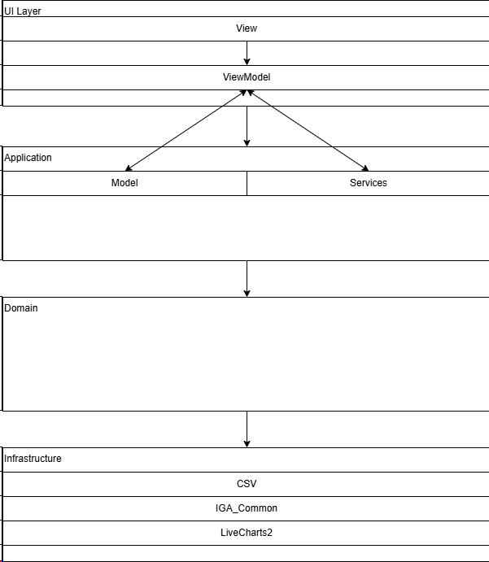

# Instant Graph Application Software Design Document

## 0. 문서 메타 정보

### 0.1 문서 버전

V1.8 초안 단계(Draft)


### 0.2 문서 변경 내역

| 날짜       | 문서 버전    | 작성자                  | 변경 내역                                                    |
| ---------- | ------------ | ----------------------- | ------------------------------------------------------------ |
| 2025-09-03 | V1.0 (Draft) | 윤상현(UpsilonSigmaEta) | 문서 최초 작성 시작0. 문서 메타 정보 기입1. 목적 \& 범위 작성2. 주요 유스 케이스 작성 |
| 2025-09-05 | V1.1         | 윤상현(UpsilonSigmaEta) | 3, 4, 5 단락 추가                                            |
| 2025-10-31 | V1.2         | 윤상현(UpsilonSigmaEta) | .html에서 Markdown으로 문서 포맷 변경                        |
| 2025-10-31 | V1.3         | 윤상현(UpsilonSigmaEta) | 5.3 단락 작성                                                |
| 2025-12-04 | V1.4         | 윤상현(UpsilonSigmaEta) | SW 기능 확장, 포함하는 기능을 확장함                         |
| 2025-12-04 | V1.5         | 윤상현(UpsilonSigmaEta) | 코드베이스 리팩터링: Model 폴더 구조 재편, 서비스/데이터/도메인 분리 |
| 2025-12-04 | V1.8         | 윤상현(UpsilonSigmaEta) | 3D 차트 기능 추가 (HelixToolkit.WPF), 데이터 테이블 정렬, X축 행 번호 선택 |


## 1. 목적 \& 범위

### 1.1 목적

','로 구분되어 있는 CSV 파일을 불러와서 빠르게 그래프를 그리고, 그려진 그래프를 분석할 수 있는 추가적인 기능을 제공하는 SW를 제작한다. 또한, 불러온 데이터에 대한 일부 편집 기능을 제공하는 SW를 작성한다.


### 1.2 범위

SW는 다음과 같은 기능을 **포함한다.**

- CSV 파일을 불러와서 파싱하고, 이를 UI에 표의 형태로 표시하는 기능.
- 불러온 데이터를 바탕으로 그래프를 그리는 기능
- 그려진 그래프에서 최댓값, 최솟값등을 찾는 등의 기본적인 분석 기능
- 선형 회귀 분석과 특정 값을 기준으로 편차를 보여주는 기능
- 데이터 Column에서 하나의 X축을 지정하고, 나머지 다수의 Y축 표시 값들을 설정할 수 있는 기능
- 차트 그래프 형태를 선택해서 확인할 수 있는 기능(꺾은선 그래프, 막대 그래프, 파이 그래프 등)
- 서로 다른 두 데이터 파일을 혼합해서 하나의 그래프에 표시하는 기능
- .xlsx등의 대중적인 데이터 포맷을 가져와서 표시하는 기능
- 통계에서 사용되는 값들을 연산하는 기능
- 탭 도킹/언도킹 기능 (AvalonDock 기반)
- **3D 차트 기능 (3D 산점도, 3D 표면 그래프)**
- **데이터 테이블 정렬 기능 (컬럼 헤더 클릭, 다중 컬럼 정렬)**
- **X축에 행 번호 선택 옵션**


SW는 다음과 같은 기능을 **포함하지 않는다.**

- 별도 미포함 기능 없음.

## 2. 주요 유스케이스

### 2.1 CSV 파일 불러오기

| Use Case ID        | UC-01                                                        |
| ------------------ | ------------------------------------------------------------ |
| 이름               | CSV를 불러와서 표 형태로 나타난 화면 보기                    |
| 레벨               | 사용자 목표                                                  |
| 주요 행위자        | 분석가 (단일 사용자)                                         |
| 범위               | IGA                                                          |
| 이해관계/이득      | 분석가 : 빠르게 데이터를 표의 형태로 시각화하여 주요 데이터를 확인 |
| 사전조건           | 로컬에 CSV 파일 존재, 사용자에게 읽기 권한 있음              |
| 최소 보장          | 파일의 손상 또는 잘못된 파일 포맷으로 인한 오류일 경우, 유스케이스를 종료하고 사용자에게 이를 고지 |
| 성공 보장          | CSV 파일을 불러와서 올바르게 헤더와 함께 표의 형태로 내용을 표시 |
| 트리거             | 사용자가 도구 모음에서 '파일 열기'를 클릭함                  |
| 메인 성공 시나리오 | 1. 사용자가 CSV 파일을 선택한다.2. 응용 프로그램은 해당 CSV 파일의 내용을 읽어온다. CSV 파일의 내용을 읽어오는 것이 끝나면 해당 파일을 닫는다.3. 읽어온 CSV 파일의 내용을 파싱해서 첫 번째 행을 Header로 삼는다.4. 두 번째 행부터 Content로 삼고, CSV 파일의 이름으로 생성된 탭의 데이터 그리드에 데이터를 채워넣는다.5. 분석 도구모음의 항목들을 활성화 시킨다. |
| 대안/예외 흐름     | 1a. 기본 인코딩이 UTF-8이 아님 → 사용자에게 UTF-8이 인코딩이 아니므로 내용이 깨질 수 있음을 경고하고 2로 진행1b. 사용자가 올바르지 않은 포맷의 파일을 선택함 → 사용자에게 파일의 포맷이 올바르지 않음을 알리고, 1로 복귀2a. CSV 파일의 내용을 읽어오던 도중, 파일이 삭제됨 → 사용자에게 파일을 제대로 읽어올 수 없음을 알리고, Use Case 실행 중지2b. CSV 파일의 내용을 읽어오던 도중 응용 프로그램이 종료됨 → 응용 프로그램 종료 시나리오로 이동3a. CSV 파일이 비어있어서 읽어온 내용이 없음 → 사용자에게 CSV 파일에서 읽어온 내용이 없음을 경고하고 Use Case 실행 중지4a. 그리드에 데이터를 채워넣는 도중 에러가 발생함 → 사용자에게 오류가 발생했음을 알리고 Use Case 실행 중지4b. 두 번째 행의 내용이 없음 → 사용자에게 Header를 제외한 데이터가 없음을 알리고 Use Case 실행 중지 |
| 비기능/특수 요구   | 50 MB 짜리 csv 파일을 기준으로 10초 내에 그리드에 데이터 표시 성공일부 행에서 일부 열이 빠져 있더라도 성공적으로 데이터가 없는 열을 제외하고 그리드에 표시 |
| 수용 기준(AC)      | 비기능/특수 요구를 지키면서 메인 성공 시나리오대로 진행 후 시나리오가 성공함 |


### 2.2 데이터 그리드 수정 후 CSV 파일로 Export 하기

| Use Case ID        | UC-02                                                        |
| ------------------ | ------------------------------------------------------------ |
| 이름               | 데이터 그리드 수정 후 CSV 파일로 Export 하기                 |
| 레벨               | 사용자 목표                                                  |
| 주요 행위자        | 분석가 (단일 사용자)                                         |
| 범위               | IGA                                                          |
| 이해관계/이득      | 분석가 : 빠르게 일부 데이터를 편집한 후 이를 다시 파일로 저장 |
| 사전조건           | 이미 로드된 데이터가 있음, 사용자에게 쓰기 권한 있음         |
| 최소 보장          | 저장할 수 없는 경우, 사유를 사용자에게 알림                  |
| 성공 보장          | 데이터 그리드에 표시되는 내용을 성공적으로 csv 파일로 저장함. |
| 트리거             | 사용자가 도구 모음에서 '파일 저장'을 클릭함                  |
| 메인 성공 시나리오 | 1. 사용자가 파일을 저장할 위치로 이동한다.2. 사용자가 저장할 파일명을 입력하고 저장 버튼을 누른다.3. 데이터 그리드에 있는 데이터들을 CSV 문자열로 변환하고, 파일에 쓴다.4. 파일에 쓰기가 끝나면 '저장 성공'이라는 메시지 박스를 띄운다. |
| 대안/예외 흐름     | 2a. 올바르지 않은 파일명 입력 → 올바르지 않은 파일명임을 사용자에게 알리고, 2번으로 복귀.2b. 올바르지 않은 경로 → 올바르지 않은 경로임을 사용자에게 알리고, 1번으로 복귀. |
| 비기능/특수 요구   | 50만개 레코드를 기준으로 10초 이내에 저장일부 행에 데이터가 빠져 있더라도 CSV 파일 포맷 준수하며 저장 |
| 수용 기준(AC)      | 비기능/특수 요구를 지키면서 메인 성공 시나리오대로 진행 후 시나리오가 성공함 |


### 2.3 불러온 데이터를 바탕으로 그래프 그리기

| Use Case ID        | UC-03                                                        |
| ------------------ | ------------------------------------------------------------ |
| 이름               | 불러온 데이터르 바탕으로 그래프 그리기                       |
| 레벨               | 사용자 목표                                                  |
| 주요 행위자        | 분석가 (단일 사용자)                                         |
| 범위               | IGA                                                          |
| 이해관계/이득      | 분석가 : 불러온 데이터를 분석해서 그래프를 확인하고 싶음     |
| 사전조건           | 이미 로드된 데이터가 있음                                    |
| 최소 보장          | 그래프를 그릴 수 없는 경우 사용자에게 이를 알림              |
| 성공 보장          | 데이터 그리드 우측 그래프 화면에 그래프가 표시됨             |
| 트리거             | 사용자가 '분석'에서 '그래프'를 클릭함                        |
| 메인 성공 시나리오 | 1. 사용자가 분석 드롭다운 메뉴를 연다.2. 분석 드롭다운 메뉴에서 그래프 메뉴 아이템을 클릭한다.3. 데이터 그리드에 로드된 데이터를 기반으로 그래프에 데이터를 삽입한다.4. 그래프를 화면에 표시한다.. |
| 대안/예외 흐름     | 3a. 그래프의 데이터에 적절치 못한 데이터가 있음 (X만 존재, Y만 존재 등) → 사용자에게 경고 표시 후 1로 복귀3b. 데이터 그리드에 로드 된 데이터가 유효하지 않음 → 사용자에게 경고 표시 후 1로 복귀 |
| 비기능/특수 요구   | 50만개 데이터를 기준으로 그래프가 그려지는 시간이 10초 이내  |
| 수용 기준(AC)      | 비기능/특수 요구를 지키면서 메인 성공 시나리오대로 진행 후 시나리오가 성공함 |


### 2.4 그래프에서 최댓값 찾기

| Use Case ID        | UC-04                                                        |
| ------------------ | ------------------------------------------------------------ |
| 이름               | 그려진 그래프에서 최댓값을 찾기                              |
| 레벨               | 사용자 목표                                                  |
| 주요 행위자        | 분석가 (단일 사용자)                                         |
| 범위               | IGA                                                          |
| 이해관계/이득      | 분석가 : 그래프에서 최댓값을 확인하고 싶음                   |
| 사전조건           | 이미 로드된 데이터가 있음, 그려진 그래프가 있음.             |
| 최소 보장          | 현재 그래프 상에서 최댓값 지점에 마커를 찍고, 마커의 좌표를 표시함. |
| 성공 보장          | 그래프 화면의 최댓값 지점에 마커가 표시되고, 마커 옆에 좌표가 표시됨 |
| 트리거             | 사용자가 '분석'에서 '최댓값 찾기'를 클릭함.                  |
| 메인 성공 시나리오 | 1. 사용자가 분석 드롭다운 메뉴를 연다.2. 분석 드롭다운 메뉴에서 최댓값 찾기 메뉴 아이템을 클릭한다.3. 그려진 그래프에서 최댓값 데이터를 찾는다.4. 최댓값 지점에 마커를 표시한다.5. 마커 오른쪽에 현재 마커의 좌표를 표시한다. |
| 대안/예외 흐름     | 없음                                                         |
| 비기능/특수 요구   | 최댓값을 찾는데 걸리는 시간은 3초 이내                       |
| 수용 기준(AC)      | 비기능/특수 요구를 지키면서 메인 성공 시나리오대로 진행 후 시나리오가 성공함 |


### 2.5 그래프에서 최소값 찾기

| Use Case ID        | UC-05                                                        |
| ------------------ | ------------------------------------------------------------ |
| 이름               | 그려진 그래프에서 최솟값을 찾기                              |
| 레벨               | 사용자 목표                                                  |
| 주요 행위자        | 분석가 (단일 사용자)                                         |
| 범위               | IGA                                                          |
| 이해관계/이득      | 분석가 : 그래프에서 최소값을 확인하고 싶음                   |
| 사전조건           | 이미 로드된 데이터가 있음, 그려진 그래프가 있음.             |
| 최소 보장          | 현재 그래프 상에서 최소값 지점에 마커를 찍고, 마커의 좌표를 표시함. |
| 성공 보장          | 그래프 화면의 최소값 지점에 마커가 표시되고, 마커 옆에 좌표가 표시됨 |
| 트리거             | 사용자가 '분석'에서 '최소값 찾기'를 클릭함.                  |
| 메인 성공 시나리오 | 1. 사용자가 분석 드롭다운 메뉴를 연다.2. 분석 드롭다운 메뉴에서 최솟값 찾기 메뉴 아이템을 클릭한다.3. 그려진 그래프에서 최소값 데이터를 찾는다.4. 최소값 지점에 마커를 표시한다.5. 마커 오른쪽에 현재 마커의 좌표를 표시한다. |
| 대안/예외 흐름     | 없음                                                         |
| 비기능/특수 요구   | 최소값을 찾는데 걸리는 시간은 3초 이내                       |
| 수용 기준(AC)      | 비기능/특수 요구를 지키면서 메인 성공 시나리오대로 진행 후 시나리오가 성공함 |


### 2.6 3D 차트로 데이터 시각화하기

| Use Case ID        | UC-06                                                        |
| ------------------ | ------------------------------------------------------------ |
| 이름               | 3D 차트로 데이터 시각화하기                                  |
| 레벨               | 사용자 목표                                                  |
| 주요 행위자        | 분석가 (단일 사용자)                                         |
| 범위               | IGA                                                          |
| 이해관계/이득      | 분석가 : 3차원 데이터를 3D 차트로 시각화하여 패턴 분석       |
| 사전조건           | 이미 로드된 데이터가 있음, 최소 3개의 숫자형 컬럼 존재       |
| 최소 보장          | 3D 차트를 그릴 수 없는 경우 사용자에게 이를 알림             |
| 성공 보장          | HelixViewport3D에 3D 차트(산점도 또는 표면)가 표시됨         |
| 트리거             | 사용자가 차트 유형에서 '3D 점 그래프' 또는 '3D 표면 그래프' 선택 |
| 메인 성공 시나리오 | 1. 사용자가 X축, Y축, Z축 컬럼을 선택한다.2. 차트 유형에서 3D 차트를 선택한다.3. 그래프 그리기 버튼을 클릭한다.4. 3D 뷰포트에 데이터가 표시된다.5. 마우스로 회전/확대/이동하여 다양한 각도에서 확인한다. |
| 대안/예외 흐름     | 1a. Z축 컬럼을 선택하지 않음 → 3D 차트 유형 선택 불가3a. 숫자형이 아닌 데이터 포함 → 경고 후 해당 데이터 제외 |
| 비기능/특수 요구   | 10000개 이하의 3D 데이터 포인트를 3초 이내에 렌더링          |
| 수용 기준(AC)      | 비기능/특수 요구를 지키면서 메인 성공 시나리오대로 진행 후 시나리오가 성공함 |


## 3. 가정 & 제약

### 3.1 가정

- [A-01] 사용자는 응용 프로그램을 오프라인 환경에서 사용한다.
- [A-02] CSV는 단일 테이블 구조이며, 헤더가 있을수도, 없을수도 있다.
- [A-03] 2D 차트 라이브러리는 LiveCharts2를 사용한다.
- [A-04] 3D 차트 라이브러리는 HelixToolkit.WPF를 사용한다.


### 3.2 제약

- [C-01] 대상 플랫폼은 Windows 11 x64, .NET 9.0 지원 환경으로 정한다.
- [C-02] 처리 가능한 입력은 CSV 파일 및 Excel 파일(.xlsx, .xls, .xlsm). 인코딩은 UTF-8로 처리한다.
- [C-03] 응용 프로그램 실행 후 화면 표시까지 10초 이내에 처리되어야 한다.
- [C-04] 메모리는 제한하지 않는다.
- [C-05] 외부 네트워크와 통신하지 않고, 로그에 파일의 내용을 기록하지 않는다.
- [C-06] 2D 차트 유형은 꺾은선, 막대(세로/가로), 영역, 점, 계단형, 파이 그래프를 지원한다.
- [C-07] 3D 차트 유형은 3D 산점도, 3D 표면 그래프를 지원한다.


## 4. 아키텍쳐 개요

### 4.1 레이어 구조



- UI → Infrastructure 직접 참조는 금지됨
- View는 Model이나 Service와 직접 상호작용해서는 안되며, 언제나 ViewModel을 통해서 간접 상호작용만 허용됨.


### 4.2 데이터/이벤트 흐름


- 기본적으로 데이터 바인딩을 통해서 연결된 객체들로 상호작용 하는 것을 원칙으로 함
- 특수한 경우거나 필요한 경우에만 이벤트 버스(Event Bus)를 통해서 발행(Publish) 및 구독(Subscribe)을 이용해서 데이터 전달 및 처리 과정 진행


### 4.3 기술 스택

- CSV 처리 → 자체적으로 CSV 처리 코드 작성 (CsvParser, CsvExporter)
- Excel 처리 → ClosedXML 라이브러리 사용
- 2D 그래프 그리기 → LiveCharts2를 사용, MIT 라이센스.
- 3D 그래프 그리기 → HelixToolkit.WPF를 사용, MIT 라이센스.
- 도킹 시스템 → AvalonDock 사용, Ms-PL 라이센스
- 구동에 필요한 라이브러리는 Binary 파일 배포시에 같이 배포
- UI 프레임워크는 WPF 프레임워크 사용


## 5. 컴포넌트 설계

### 5.1 Model 폴더 구조 (V1.8)

```
Model/
├── Data/           # 데이터 모델 클래스
│   ├── CsvDataModel.cs       # CSV 데이터 모델
│   ├── ChartDataPoint.cs     # 2D 차트 데이터 포인트
│   ├── ChartDataPoint3D.cs   # 3D 차트 데이터 포인트 (NEW)
│   ├── SurfaceData.cs        # 3D 표면 그래프 데이터 (NEW)
│   └── ChartType.cs          # 차트 유형 열거형 (3D 타입 포함)
│
├── Service/        # 비즈니스 로직 서비스
│   ├── CsvParser.cs          # CSV 파일 파싱
│   ├── CsvExporter.cs        # CSV 파일 내보내기
│   ├── ExcelHandler.cs       # Excel 파일 처리
│   ├── GraphAnalyzer.cs      # 그래프 분석 (통계, 회귀, 극값)
│   ├── ChartSeriesFactory.cs # 2D 차트 시리즈 생성 팩토리
│   ├── Chart3DFactory.cs     # 3D 차트 요소 생성 팩토리 (NEW)
│   └── ChartExporter.cs      # 차트 이미지 내보내기
│
└── Domain/         # 도메인 모델 및 UI 바인딩 모델
    ├── DockDocumentModel.cs      # AvalonDock 문서 모델
    ├── StatisticsResult.cs       # 통계 계산 결과
    ├── LinearRegressionResult.cs # 선형 회귀 결과
    ├── YColumnSelectionItem.cs   # Y축 선택 항목
    └── DataSourceItem.cs         # 데이터 소스 선택 항목
```

### 5.2 서비스 컴포넌트 상세

#### 5.2.1 CsvParser (CSV 파싱 서비스)
- **위치**: `Model/Service/CsvParser.cs`
- **책임**: CSV 파일 읽기 및 파싱
- **주요 메서드**:
  - `LoadFromFile(string __filePath)`: CSV 파일을 CsvDataModel로 변환
  - `IsUtf8Encoding(string __filePath)`: UTF-8 인코딩 확인
  - `ParseLine(string __line)`: CSV 행 파싱 (따옴표 처리 포함)

#### 5.2.2 CsvExporter (CSV 내보내기 서비스)
- **위치**: `Model/Service/CsvExporter.cs`
- **책임**: 데이터를 CSV 형식으로 내보내기
- **주요 메서드**:
  - `ExportToString(CsvDataModel __csvData)`: CsvDataModel을 CSV 문자열로 변환
  - `ExportToString(DataTable __dataTable)`: DataTable을 CSV 문자열로 변환
  - `SaveToFile(...)`: CSV 파일 저장

#### 5.2.3 ExcelHandler (Excel 처리 서비스)
- **위치**: `Model/Service/ExcelHandler.cs`
- **책임**: Excel 파일(.xlsx, .xls, .xlsm) 읽기
- **주요 메서드**:
  - `LoadFromFile(string __filePath, int __sheetIndex)`: Excel 파일을 CsvDataModel로 변환
  - `GetSheetNames(string __filePath)`: 시트 이름 목록 반환
  - `IsExcelFile(string __filePath)`: Excel 파일 여부 확인

#### 5.2.4 GraphAnalyzer (그래프 분석 서비스)
- **위치**: `Model/Service/GraphAnalyzer.cs`
- **책임**: 데이터 분석 및 통계 계산
- **주요 메서드**:
  - 극값 찾기: `FindMax()`, `FindMin()`
  - 통계 연산: `CalculateMean()`, `CalculateVariance()`, `CalculateStandardDeviation()`, `CalculateAllStatistics()`
  - 선형 회귀: `CalculateLinearRegression()`, `GenerateRegressionLine()`
  - 편차 분석: `CalculateDeviations()`, `CalculateMeanAbsoluteDeviation()`

#### 5.2.5 ChartSeriesFactory (2D 차트 시리즈 팩토리)
- **위치**: `Model/Service/ChartSeriesFactory.cs`
- **책임**: LiveCharts2 시리즈 객체 생성
- **주요 메서드**:
  - `CreateSeries(ChartType, string, ObservableCollection<ChartDataPoint>, SKColor)`: 차트 유형별 시리즈 생성
  - `CreateLineSeries()`, `CreateColumnSeries()`, `CreateBarSeries()`, `CreateAreaSeries()`, `CreateScatterSeries()`, `CreateStepLineSeries()`: 개별 차트 유형 생성
  - `CreatePieSeries()`: 파이 차트 시리즈 생성
  - `CreateRegressionLineSeries()`: 회귀선 시리즈 생성
  - `CreateMarkerSeries()`: 마커 시리즈 생성 (최대/최소값 표시)

#### 5.2.6 Chart3DFactory (3D 차트 팩토리) - V1.8 NEW
- **위치**: `Model/Service/Chart3DFactory.cs`
- **책임**: HelixToolkit.WPF를 사용한 3D 시각화 요소 생성
- **주요 메서드**:
  - `CreateScatter3D(IEnumerable<ChartDataPoint3D>, double, bool)`: 3D 산점도 생성
  - `CreateSurface3D(SurfaceData, bool)`: 3D 표면 그래프 생성
  - `CreateAxes3D(...)`: 3D 축 생성 (X: 빨강, Y: 초록, Z: 파랑)
  - `CreateGridFloor(...)`: 3D 그리드 바닥면 생성
  - `GetColorFromGradient(double)`: 파랑→초록→노랑→빨강 그라데이션 색상
- **색상 팔레트**: DodgerBlue, OrangeRed, LimeGreen, Purple, Gold, Crimson, Teal, HotPink

### 5.3 데이터 모델 상세

#### 5.3.1 ChartDataPoint3D - V1.8 NEW
- **위치**: `Model/Data/ChartDataPoint3D.cs`
- **책임**: 3D 차트 데이터 포인트 저장
- **속성**:
  - `X`, `Y`, `Z`: 3차원 좌표 (double)
  - `Label`: 데이터 포인트 레이블 (optional)
- **메서드**:
  - `ToPoint3D()`: WPF Media3D Point3D로 변환

#### 5.3.2 SurfaceData - V1.8 NEW
- **위치**: `Model/Data/SurfaceData.cs`
- **책임**: 3D 표면 그래프용 그리드 데이터 저장
- **속성**:
  - `Values`: 2D 배열 Z값 그리드 (double[,])
  - `XMin`, `XMax`, `YMin`, `YMax`, `ZMin`, `ZMax`: 축 범위
  - `XCount`, `YCount`: 그리드 해상도
- **정적 메서드**:
  - `FromScatterPoints(IEnumerable<ChartDataPoint3D>, int)`: 산점 데이터를 IDW 보간으로 표면 데이터 변환

#### 5.3.3 ChartType (확장)
- **위치**: `Model/Data/ChartType.cs`
- **추가된 열거값**:
  - `Scatter3D`: 3D 점 그래프 (산점도)
  - `Surface3D`: 3D 표면 그래프
- **ChartTypeItem.Is3D**: 3D 차트 여부 판별 속성

### 5.4 ViewModel 구조

#### 5.4.1 MainViewModel
- **위치**: `ViewModel/MainViewModel.cs`
- **책임**: 메인 화면 관리, 도킹 문서 관리, 파일/분석 메뉴 커맨드 처리
- **주요 속성**:
  - `Documents`: 도킹 문서 컬렉션
  - `ActiveDocument`: 현재 활성 문서
- **주요 커맨드**:
  - 파일: `MenuFileSaveCommand`, `MenuFileOpenCommand`, `MenuFileImportDataCommand`, `MenuFileExportDataCommand`
  - 분석: `MenuAnalysisDrawGraphCommand`, `MenuAnalysisFindMaxCommand`, `MenuAnalysisFindMinCommand`, `MenuAnalysisRegressionCommand`, `MenuAnalysisStatisticsCommand`

#### 5.4.2 DataAnalysisViewModel
- **위치**: `ViewModel/DataAnalysisViewModel.cs`
- **책임**: 데이터 분석 화면 관리, 2D/3D 차트 렌더링, 분석 기능 실행
- **주요 속성**:
  - 데이터: `CsvData`, `DataTable`, `HasData`
  - 2D 차트: `ChartSeries`, `XAxes`, `YAxes`, `PieSeries`
  - 3D 차트: `Chart3DModel`, `Is3DChartVisible`, `SelectedZColumnIndex`, `Data3DPoints`
  - 3D 옵션: `ShowWireframe`, `ShowAxes3D`, `ShowGridFloor`
  - 분석 결과: `MaxValueText`, `MinValueText`, `StatisticsText`, `RegressionText`
  - 차트 옵션: `SelectedChartType`, `ShowRegressionLine`, `ShowDeviations`
  - X축 옵션: `XAxisOptions` (행 번호 포함)
- **주요 커맨드**:
  - `DrawGraphCommand`, `FindMaxCommand`, `FindMinCommand`
  - `CalculateRegressionCommand`, `CalculateStatisticsCommand`
  - `MergeDataCommand`, `ClearOverlayDataCommand`
- **V1.8 추가 메서드**:
  - `Draw3DGraph()`: 3D 차트 렌더링 분기
  - `Draw3DScatterChart()`: 3D 산점도 생성
  - `Draw3DSurfaceChart()`: 3D 표면 그래프 생성
  - `GetXValuesAndName()`: X축 데이터 획득 (행 번호 옵션 지원)

### 5.5 도메인 모델

#### 5.5.1 StatisticsResult
- 통계 계산 결과를 담는 데이터 클래스
- 속성: Count, Sum, Mean, Variance, StandardDeviation, SampleVariance, SampleStandardDeviation, Max, MaxIndex, Min, MinIndex, Range

#### 5.5.2 LinearRegressionResult
- 선형 회귀 분석 결과를 담는 데이터 클래스
- 속성: Slope, Intercept, RSquared, Correlation, DataCount
- 메서드: `GetEquation()` - 회귀식 문자열 반환

#### 5.5.3 DockDocumentModel
- AvalonDock 도킹 문서를 위한 모델
- 속성: Title, Content (IViewModel), CanClose, IsSelected
- 이벤트: CloseRequested

### 5.6 View 구조 (V1.8)

#### 5.6.1 DataAnalysisView.xaml
- **3D 관련 UI 요소**:
  - Z축 선택 ComboBox (3D 차트 선택 시 표시)
  - 3D 옵션 체크박스 (와이어프레임, 축, 그리드)
  - HelixViewport3D (3D 차트 렌더링)
- **X축 옵션**: "(행 번호)" 옵션 포함된 ComboBox

#### 5.6.2 DataAnalysisView.xaml.cs - V1.8 NEW
- **데이터 테이블 정렬 이벤트 핸들러**:
  - 컬럼 헤더 클릭: 오름차순/내림차순 토글
  - Shift + 클릭: 다중 컬럼 정렬 (기존 정렬 유지하며 추가)
- **차트 저장 버튼 핸들러**

## 6. 의존성 및 라이센스

| 패키지 | 버전 | 라이센스 | URL |
|--------|------|----------|-----|
| ClosedXML | 0.104.2 | MIT | [NuGet](https://www.nuget.org/packages/closedxml/) |
| LiveChartsCore.SkiaSharpView.WPF | 2.0.0-rc4.5 | MIT | [GitHub](https://github.com/beto-rodriguez/LiveCharts2) |
| HelixToolkit.Wpf | 2.25.0 | MIT | [GitHub](https://github.com/helix-toolkit/helix-toolkit) |
| SkiaSharp | (transitive) | MIT | [GitHub](https://github.com/mono/SkiaSharp) |
| Dirkster.AvalonDock | 4.72.1 | Ms-PL | [GitHub](https://github.com/Dirkster99/AvalonDock) |
| Microsoft.Extensions.DependencyInjection | 9.0.8 | MIT | [NuGet](https://www.nuget.org/packages/microsoft.extensions.dependencyinjection) |
